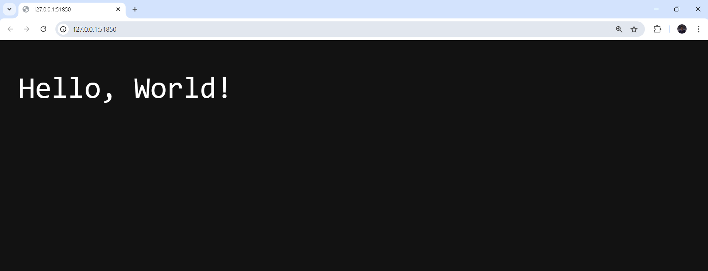
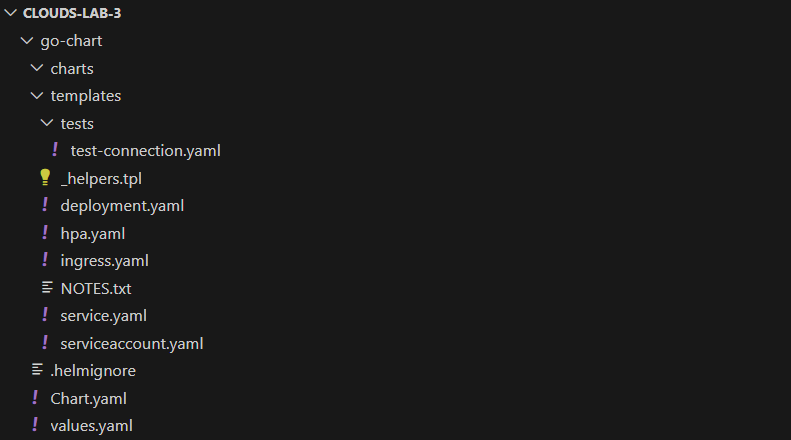
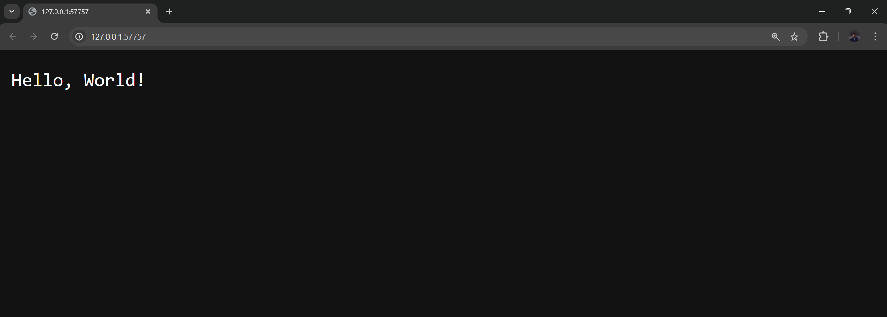
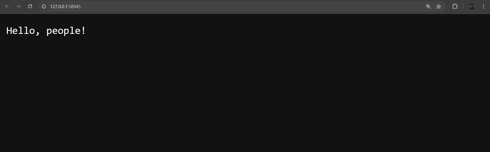

# Лабораторная работа #3. Kubernetes

## Часть 1

## Введение

Цель данной работы состоит в том, чтобы поднять локально кластер Kubernetes. Однако перед тем, как поднимать этот самый кластер, необходимо разобраться, что из себя в принципе представляет этот самый Kubernetes.

### Что такое Kubernetes?

Если говорить кратко, то **Kubernetes** - программное обеспечение, позволяющее автоматически управлять контейнеризированными приложениями и заметно облегчающее работу с ними.

Kubernetes пользуется огромное количество компаний и разработчиков по всему миру, ведь при работе с контейнерами он обладает следующими преимуществами:
- Легкое и автоматическое масштабирование
- Управление развертыванием приложения
- Обеспечение стабильной работы приложения *(восстановление и т. д.)*
- Балансировка нагрузки
- и так далее

Таким образом, в наше время Kubernetes является практически неотъемлемой частью процесса разработки, развертывания и эксплуатации программного продукта.

В ходе выполнения данной лабораторной работы было необходимо поднять *кластер Kubernetes*, то есть группу серверов, которые вместе управляют контейнерами.

В качестве инструмента для запуска локального кластера на устройстве был выбран **minikube**. minikube обладает большим количеством достоинств по сравнению с другими инструментами, такими как простота использования, поддержка различных дополнений и гибкость настроек, однако для выполнения данной лабораторной работы он был выбран именно засчет первого.

## Ход выполнения

### Установка minikube

В первую очередь minikube надо было установить на устройство. В этом может помочь [инструкция с официального сайта Kubernetes](https://kubernetes.io/ru/docs/tasks/tools/install-minikube/).

Перед установкой было необходимо проверить, поддерживается ли на устройстве виртуализация. Для этого в Windows Terminal была вбита команда `systeminfo`, после чего в ответе была получена в том числе и следующая строчка:

```
Hyper-V Requirements: A hypervisor has been detected. Features required for Hyper-V will not be displayed.
```

Данная строка означается, что на устройстве поддерживается виртуализация, а также уже установлен гипервизор, то есть перед установкой minikube ничего устанавливать дополнительно не надо. Радуемся этому и идем дальше.

#### Установка kubectl

Перед непосредственной установкой minikube необходимо было установить kubectl - инструмент командной строки для работы с Kubernetes. Сделать это можно разными способами, воспользовавшись [инструкцией с официального сайта](https://kubernetes.io/ru/docs/tasks/tools/install-kubectl/#%D1%83%D1%81%D1%82%D0%B0%D0%BD%D0%BE%D0%B2%D0%BA%D0%B0-kubectl-%D0%B2-windows). После установки, вбив в командную строку ```kubectl version --client```, убеждаемся в наличии kubectl на устройстве:

```zsh
Client Version: v1.31.1
Kustomize Version: v5.4.2
```

#### И наконец сам minikube

Наконец, устанавливаем сам minikube. Это можно сделать несколькими способами, для меня самым удобным оказался способ установки с помощью исполняемого файла. Думаю, показывать, как я это делал, тут явно будет лишним.

#### Проверка установки

На прошлом шаге minikube был установлен, на данном же этапе необходимо проверить, успешно ли. Для этого запустим локальный кластер minikube на устройстве, вбив в консоль ```minikube start --vm-driver=hyperv```, где hyperv - имя установленного на устройстве гипервизора.

(Ждём много минут...)

Кажется, что minikube заработал. Чтобы убедиться в этом, вбиваем в консоль команду ```minikube status``` и получаем ответ:

```zsh
minikube
type: Control Plane
host: Running
kubelet: Running
apiserver: Running
kubeconfig: Configured
```

Отлично! Данный ответ говорит нам о том, что minikube установлен и успешно запускается с выбранным гипервизором.


### Создание приложения

Затем было необходимо создать само приложение. Так как целью данной лабораторной работы является поднятие кластера Kubernetes, а не создание приложения, был создан простейший веб-сервер на Go, весь код которого содержится в файле ```main.go```.

```go
package main

import (
	"fmt"
	"net/http"
)

func handler(w http.ResponseWriter, r *http.Request) {
	fmt.Fprintf(w, "Hello, World!")
}

func main() {
	http.HandleFunc("/", handler)
	http.ListenAndServe(":9999", nil)
}
```
Думаю, глядя на код, любой сможет с уверенностью сказать, что делает это приложение - оно запускат веб-сервер на порту 9999. Воспользуемся утилитой **curl** в командной строке: после ввода команды ```curl localhost:9999``` получаем в ответ наш заветный ```Hello, World!```.

### Собираем Docker-образ

На следующем этапе необходимо собрать Docker-образ приложения и поместить его в локальное хранилище minikube.

#### Написание Dockerfile

Первым делом создаём Dockerfile:
```dockerfile
# Используем базовый легковесный образ
FROM golang:1.20-alpine  

# Рабочая директория внутри контейнера
WORKDIR /app

# Копирование исходного кода приложения
COPY . .

# Создание бинарного файла
RUN go build -o main .

# Запуск веб-сервера
CMD ["/app/main"]

# Слушаем порт, использующийся в приложении
EXPOSE 9999
```

#### Создаем образ и проверяем

Ну и собираем наш Docker-образ с помощью команды ```docker build -t app-go .```, получая в ответ строчку ```[+] Building 8.3s (9/9) FINISHED```, что говорит о том, что docker-образ был создан успешно.

На всякий случай проверяем, введя в консоль ```docker images```:
```zsh
REPOSITORY   TAG                IMAGE ID       CREATED              SIZE
app-go       latest             ea49148bf580   About a minute ago   323MB
postgres     16.3               cff6b68a194a   5 months ago         432MB
sonarqube    10.5.1-community   b728f044f72f   5 months ago         787MB
```

Видим на второй строке наш docker-образ. Ура, кажется, мы всё сделали правильно, идём дальше.

### Создание yaml-файлов

Далее нам необходимо создать yaml-файлы (манифесты). 

#### deployment.yaml

Первым создадим yaml-файлов для деплоя нашего приложения:

```yaml
apiVersion: apps/v1 # Версия API
kind: Deployment # Указываем объект типа Deployment
metadata:
  name: app-deployment # Имя деплоймента
spec:
  replicas: 2 # Количество подов для развертывания
  selector:
    matchLabels:
      app: app
  template:
    metadata:
      labels:
        app: app
    spec:
      containers:
      - name: app-container # Имя контейнера
        image: app-go # Используемый docker-образ
        imagePullPolicy: Never # ВОТ БЕЗ ЭТОЙ СТРОЧКИ НЕ РАБОТАЛО НИЧЕГО
        ports:
        - containerPort: 9999 # Открываем порт 9999 в контейнере
```

Хочется обратить внимание на строчку ```imagePullPolicy: Never```, без которой ничего не хотело запускаться. Она нужна для того, чтобы minikube искал Docker-образ именно на локальном устройстве.

#### service.yaml

Также создадим service-файл, нужный для того, чтобы открыть доступ к приложению:

```yaml
apiVersion: v1 # Версия API
kind: Service # Указываем объект типа Service
metadata:
  name: app-service # Имя сервиса
spec:
  type: NodePort # Тип сервиса
  selector:
    app: app
  ports:
    - protocol: TCP # Используем протокол TCP для передачи данных
      port: 80
      targetPort: 9999 # Внутренний порт
      nodePort: 30000 # Внешний порт
```

Наконец, применяем данные ресурсы, используя команду ```kubectl apply -f deployment.yaml -f service.yaml```. После этого всё уже должно работать, можно проверять работу.

### Проверка работоспособности

Чтобы открыть страницу в браузере, можно воспользоваться командой ```minikube service app-service```, которая вывыдет в консоль информацию о нашем работающем сервисе:
```
|-----------|-------------|-------------|---------------------------|
| NAMESPACE |    NAME     | TARGET PORT |            URL            |
|-----------|-------------|-------------|---------------------------|
| default   | app-service |          80 | http://192.168.49.2:30000 |
|-----------|-------------|-------------|---------------------------|
* Starting tunnel for service app-service.
|-----------|-------------|-------------|------------------------|
| NAMESPACE |    NAME     | TARGET PORT |          URL           |
|-----------|-------------|-------------|------------------------|
| default   | app-service |             | http://127.0.0.1:51850 |
|-----------|-------------|-------------|------------------------|
```

Мы видим, что minikube запускает сервис на своём ip *(192.168.49.2)*, используя порт, который был прописан в манифесте *(30000)*. При этом для удобства minikube сразу же создаёт "тунель", чтобы мы могли воспользоваться сервисом на нашем устройстве. Переходим по второму адресу *(127.0.0.1:51850)* и видим нашу "замечательную" страницу:



> **Ура! В ходе выполнения лабораторной работы получилось поднять на устройстве кластер Kubernetes.**

## Часть 2

Во второй части лабораторной работы было необходимо провести работу с *Helm*. Для начала было бы неплохо разобраться в том, что этот *Helm* из себя вообще представляет.

> **Helm** - менеджер пакетов для *Kubernetes*, позволяющий оборачивать приложения *Kubernetes* в удобные пакеты, которые называются чартами, и таким образом значительно упрощающий процесс установки, управления и масштабирования приложений в кластере.

#### Установка *helm*

Первым делом *helm* нужно было установить на устройство. К счастью, на моем устройстве уже есть пакетный менеджер *Chocolatey*, который позволяет установить *helm* просто с помощью ввода команды ```choco install kubernetes-helm``` в командную строку.

#### Создаем чарт

Итак, helm успешно установлен, значит, самое время начать с ним работу.

Первым делом, вводим в командную строку команду ```helm create go-chart```, чтобы, как ни странно, создать наш чарт с названием *go-chart*. В ответ получаем строчку ```Creating go-chart```, что говорит о том, что *helm* был в процессе создания чарта.

После окончания выполнения команды смотрим на структуру проекта и видим, что в корневой папке проекта появилась папка *go-chart*, а в ней и другие объекты. Подробнее можно посмотреть на скрине ниже.



Рассмотрим подробнее основные объекты в данной папке:

- В папке *charts* хранятся сторонние чарты, от которых зависит данный чарт;
- В папке *templates* лежат шаблоны *Kubernetes*;
- В файле *Chart.yaml* содержится основная информация о чарте;
- В файле *values.yaml* лежат переменные, которые используются в шаблонах (в тех самых, которые лежат в папке *templates*).

#### Создаем шаблоны

Первым делом удаляем из папки все лишние, файлы которые не понадабятся в этоа лабораторной. Затем переносим наши манифесты *deployment.yaml* и *service.yaml* в папку *templates*, а все значения в них переносим в файл *values.yaml* и таким образом делаем их переменными.

Итоговый вид файла *values.yaml*, в котором хранятся переменные для шаблонов:

```yaml
appName: app
deployment:
  name: app-deployment
  replicas: 2
container:
  name: app-container
  image: app-go
  imagePullPolicy: Never
  port: 9999
service:
  name: app-service
  type: NodePort
  port: 80
  targetPort: 9999
  nodePort: 30000
```

Соответственно, теперь в файлы с шаблонами вместо самих значений можно просто подставить эти переменные.

*deployment.yaml*
```yaml
apiVersion: apps/v1
kind: Deployment
metadata:
  name: {{ .Values.deployment.name }}
spec:
  replicas: {{ .Values.deployment.replicas }}
  selector:
    matchLabels:
      app: {{ .Values.appName }}
  template:
    metadata:
      labels:
        app: {{ .Values.appName }}
    spec:
      containers:
      - name: {{ .Values.container.name }}
        image: {{ .Values.container.image }}
        imagePullPolicy: {{ .Values.container.imagePullPolicy }}
        ports:
        - containerPort: {{ .Values.container.port }}
```

*service.yaml*
```yaml
apiVersion: v1
kind: Service
metadata:
  name: {{ .Values.service.name }}
spec:
  type: {{ .Values.service.type }}
  selector:
    app: {{ .Values.appName }}
  ports:
    - protocol: TCP
      port: {{ .Values.service.port }}
      targetPort: {{ .Values.service.targetPort }}
      nodePort: {{ .Values.service.nodePort }}
```

Как видно, файлы особо никак не поменялись, просто вместо самих значений там теперь стоят переменные, в которых эти значения и хранятся. 

#### Устанавливаем чарт

Теперь устанавливаем наш чарт в кластер, введя в командную строку ```helm install go-release ./go-chart``` (и перед этим, конечно же, не забываем запустить *minikube*, что я успешно и сделал).

В случае успешного выполнения получаем такой ответ:

```
NAME: go-release
LAST DEPLOYED: Sun Nov 17 05:16:19 2024
NAMESPACE: default
STATUS: deployed
REVISION: 1
TEST SUITE: None
```

Отлично! Теперь смотрим, всё ли у нас работает: как и в предыдущей части, вводим команду ```minikube service app-service```, получаем адрес и порт, на котором у нас прокинут сервис, и открываем страницу в браузере, где успешно отображается страница нашего приложения:



#### Обновляем

Чуть обновим приложение: изменим код приложения так, чтобы вместо ```Hello, World!``` в браузере теперь выводилось ```Hello, people!```. Код приложения сильно не поменялся, теперь он выглядит так:

```go
package main

import (
	"fmt"
	"net/http"
)

func handler(w http.ResponseWriter, r *http.Request) {
	fmt.Fprintf(w, "Hello, people!")
}

func main() {
	http.HandleFunc("/", handler)
	http.ListenAndServe(":9999", nil)
}

```

После внесенных изменений необходимо пересобрать Docker-образ. По аналогии с первой частью лабораторной вводим в командную строку ```docker build -t app-go-2 .```, получая в ответ строку ```[+] Building 9.5s (10/10) FINISHED```.

Отлично, docker-образ успешно пересобран, при этом тег нового образа уже *app-go-2*, а не *app-go*. Этот же новый тег и необходимо указать теперь как значение переменной *container.image* в файле *values.yaml*, который теперь выглядит так:

```yaml
appName: app
deployment:
  name: app-deployment
  replicas: 2
container:
  name: app-container
  image: app-go-2 # Вот тут обновили значение переменной (тег Docker-образа)
  imagePullPolicy: Never
  port: 9999
service:
  name: app-service
  type: NodePort
  port: 80
  targetPort: 9999
  nodePort: 30000
```

Теперь у нас всё готово для того, чтобы обновить релиз. Используем команду ```helm upgrade go-release ./go-chart```. Получаем вот такой замечательный ответ:

```
Release "go-release" has been upgraded. Happy Helming!
NAME: go-release
LAST DEPLOYED: Mon Nov 18 10:35:23 2024
NAMESPACE: default
STATUS: deployed
REVISION: 2
TEST SUITE: None
```

Первая строчка отсюда явно указывает на то, что релиз был обновлен успешно. Идём проверять!



Ура! Всё получилось! Приложение было успешно обновлено.

### Почему helm удобнее?

Итак, теперь немного напишем о том, почему *helm* использовать будет удобнее, чем классические манифесты:
- Во-первых, *helm* позволяет развертывать приложения гораздо быстрее и эффективнее засчёт наличия шаблонов и переменных в своей концепции. Если необходимо внести какие-либо изменения в конфигурации сервисов, это можно сделать просто поменяв значение переменной в *values.yaml* - вручную идти по каждому манифесту, искать нужные строчки и менять значения не надо!
- Также *helm* гораздо удобнее для работы со сложными микросервисными приложениями благодаря возможности внедрения зависимостей, т. е. испоьзованию подчартов. В ходе выполнения данной лабораторной это не пригодилось, однако на практике при работе со сложными приложениями это является довольно большим преимуществом.
- Ну и, наконец, в *helm* хорошо реализовно управление версиями, так как сохраняются все релизы приложения. В случае какой-либо ошибки можно просто откатиться назад буквально одной командой, чего при использовании манифестов сделать, конечно, не получится.

> **ВЫВОД:** в ходе выполнения второй части лабораторной работы вместо обычных манифестов были использованы *helm* чарты. Хоть в этой лабораторной у меня и не было большого приложения с большим кол-вом манифестов и мега сложными чартами, все равно в целом манифесты показались более удобными для развертывания приложения и, самое главное, его обновления. Учитывая то, что до этого ни при манифесты, не про helm чарты я не слышал, делать лабораторную было очень интересно, спасибо!
