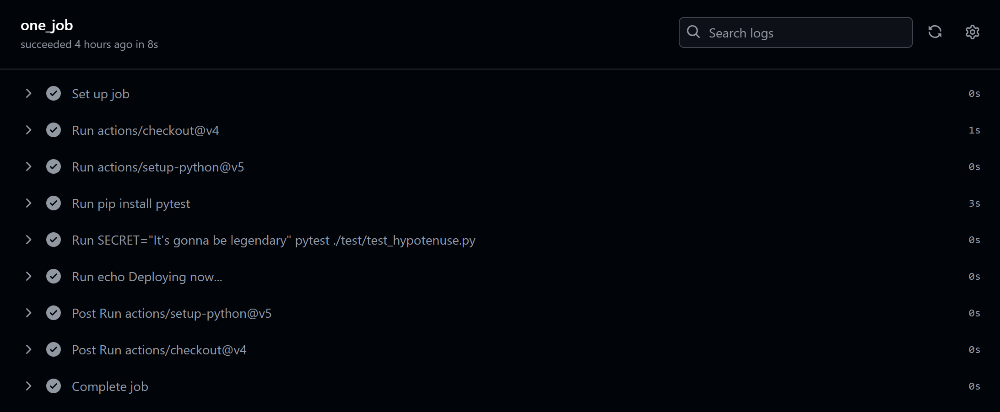
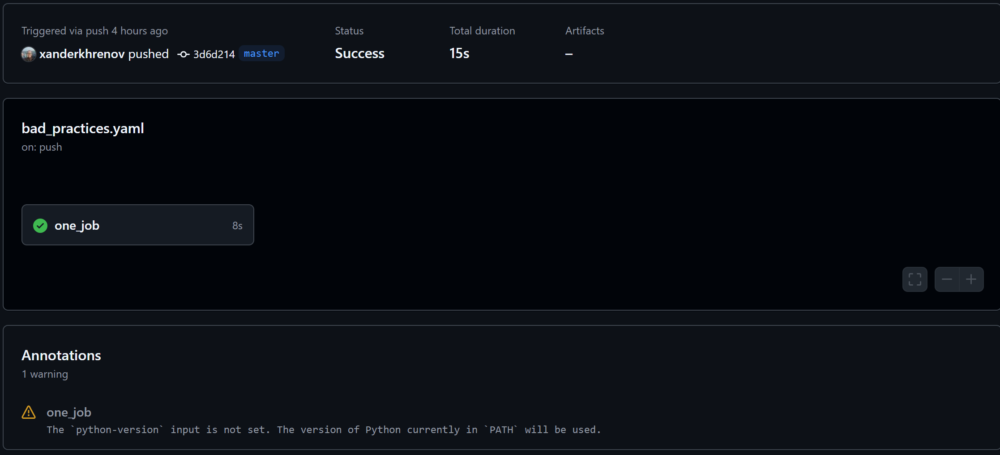
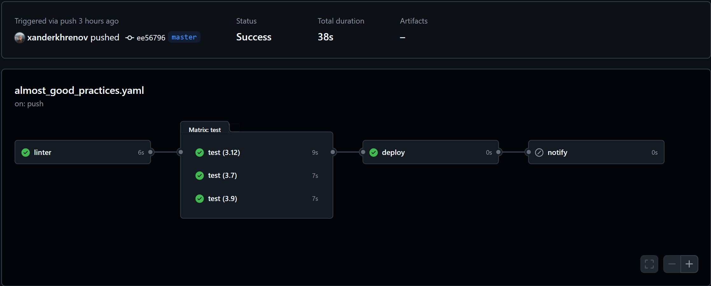

# Лабораторная работ №4 (Обычная)

На дворе 2:32 01.12.2024. Я выглянул за окно и подумал: "Наверное, надо начинать делать лабы...". Тааак, до дедлайна 
остался 21 час, 27 минут, 37 секунд. Ну уже меньше... Ладно, погнали.


## Задания
1. Написать CI/CD файл, который работает, но в нем есть не менее пяти “bad practices” по написанию CI/CD;
2. Написать “хороший” CI/CD, в котором эти плохие практики исправлены;
3. Описать каждую из плохих практик в плохом файле, почему она плохая и как в хорошем она была исправлена,
как исправление повлияло на результат.

## I'm the bad file... Duh

Начнем с того, что репу с CI/CD файлами и проектиком можно найти [здесь](https://github.com/xanderkhrenov/cloud-systems-lab4).
"Плохой" файлик можно найти [тут](https://github.com/xanderkhrenov/cloud-systems-lab4/blob/master/.github/workflows/bad_practices.yaml).
Ну а для того, чтобы не пришлось далеко бегать, код файла представлен ниже.

```yaml
on:
  push:
    branches:
      '*'

jobs:
  one_job:
    runs-on: ubuntu-latest
    steps:
      - uses: actions/checkout@v4
      - uses: actions/setup-python@v5
      - run: pip install flake8
      - run: flake8 .
      - run: pip install pytest
      - run: SECRET_CATCHPHRASE="Its gonna be legendary" pytest ./test/test_hypotenuse.py
      - run: |
          echo Deploying now...
          echo Done!!!
```

Ням-ням-ням-ням-ням... Не сказать, что мечта для искателя ~~приключений~~ ошибок, но думаю, и здесь найдем, чем поживиться.

### 1. Говорящие названия 

Как можно заметить, у workflow, job и step'ов отсутствуют качественные названия. За счет этого осознание того, что происходит,
занимает больше времени. К тому же, тут не нужно быть эстетом, просто не особо приятно читать вывод всего без пояснения, 
да и сильно погружаться в джобы, думаю, не хочется. Вердикт: добавить говорящие названия.

### 2. Описание для конкретных веток

Звездочка - это вообще страшный зверь (ни в коем случае не относится к лабам со звездочкой). Ну посудите сами: поставил *
в регулярном выражении не так и полдня разбираешь, почему строка не мэтчится; ставишь в sql-запросе не задумываясь - и 
вот потихоньку производительность катится вниз. В данном случае примерно то же самое. Обычно работа над проектами ведется
не в одиночку, и когда все будут скидывать в репу изменения, раннеры будут бешено крутиться, пытаясь прогнать все workflow,
так что нужно аккуратненько прописать, на каких ветках и когда нужно прогонять.

### 3. Разделение на этапы и использование зависимостей

В "плохом" файлике джоба только одна и в ней все записано одной "портянкой". Это неудобно читать, неудобно отслеживать 
этапы и более того, нам ведь необходимо в случае, если тесты упадут, останавливать весь процесс: нельзя выкатывать 
приложение с ошибками. То есть нужно добавить разделение на несколько job и указать зависимости между ними.



### 4. Указание версий Python (вообще используемого языка)

Так, а где версия? Вообще он хотя бы 3.* версию запустит? Даже после прогона на Github нам выводится предупреждение с 
просьбой указать версию Python.



К тому же бывает так, что необходимо проверить работоспособность кода на нескольких версиях языка, так что в исправленном
файлике укажем несколько версий языка.

### 5. Выделение переменных (и секретики) и схожих задач

С переменными +- понятно: то, что у нас может поменяться, в особенности, если повторяется несколько раз, - выносим. Что за
схожие задачи? Ну смотрите - pip install. Здесь у нас, конечно, игрушечный пример и подгружаем мы не так много библиотек,
но что будет, если их понадобится сотня? Все пихать в .yaml файлик? Не камельфо, поэтому было бы неплохо вынести это в 
отдельный файл и потом просто передавать, как список необходимого. Сюда до кучи можно докинуть и секретики, поскольку
нехорошо их хардкодить всем на обозрение, а вдруг все тесты пройдут удачно и на основании этого любой поймет, какое 
значение у секретика в системе. То есть тоже выносим.

### Немного не о плохом файле

Еще можно упомянуть ошибку, которой нет, поскольку она уже решена в "плохом" файлике, а именно применение actions. Они 
используются для установки окружения. Мы могли бы и сами это сделать, но зачем делать муторно, если можно всего одной строчкой?
Самое главное - ошибки нет, а значит и исправлять не нужно))

## Иди убирай свой Workflow...


Начнем потихоньку исправлять допущенные ошибки, но сначала дам [ссылочку](https://github.com/xanderkhrenov/cloud-systems-lab4/blob/master/.github/workflows/almost_good_practices.yaml)
на почти хороший CI/CD файл. Почему почти? Потому что совершенству нет предела))

### 1. Говорящие названия

В новый файл были добавлены имена, по которым уже можно понять, что за Workflow, какие джобы прошли, из каких шагов 
состоит каждая. 

```yaml
name: Almost good practices
...
linter:
  steps:
    - name: Checkout
    - name: Set up linter
    - name: Run linter
test:
  steps:
    - name: Checkout
    - name: Set up Python
    - name: Set up test library
    - name: Run test
deploy:
  steps:
    - name: Deployment
notify:
  steps:
    - name: Notify
```

### 2. Описание для конкретных веток

Для сбережение наших раннеров или раннеров Github была указана ветка master при push и pull request. Теперь, если кто-то 
напишет в других ветках бредятину, то она не будет прогоняться и те, кому действительно нужно прогнать workflow смогут 
с минимальной задержкой сделать это.

```yaml
on:
  push:
    branches:
      [ master ]

  pull_request:
    branches:
      [ master ]
```

### 3. Разделение на этапы и использование зависимостей

Этот пункт - вообще красота, достаточно взглянуть на цепочку джоб, их зависимость и результат изменений сразу становится
понятным.



```yaml
jobs:
  linter:

  test:
    needs: [ linter ]

  deploy:
    needs: [ test ]

  notify:
    needs: [ deploy ]
```

### 4. Указание версий Python (вообще используемого языка)

Для того, чтобы проверять, насколько успешно написанный код работает на разных версиях языка в стратегии были указаны 3 
самых популярных (ну или почти). Таким образом мы указали возможные версии, при этом сразу проверяем на нескольких, что 
код не ломается.

```yaml
test:
    strategy:
      matrix:
        version: [ 3.7, 3.9, 3.12 ]
    steps:
      - name: Set up Python
        uses: actions/setup-python@v5
        with:
          python-version: ${{matrix.version}}
```

### 5. Выделение переменных (и секретики) и схожих задач

Пожалуй, начнем с схожих задач. Сюда были добавлены библиотеки, которые необходимо подгрузить с помощью pip install. Это
позволяет в дальнейшем при необходимости большего числа библиотек не засорять CI/CD файл, а в отдельном файле прописать
их и единожды вызвать. В переменные были вынесены пути до файлов, в которых хранятся значения нужных библиотек. 
В будущем эти пути могут поменяться, так что переменные помогут избежать головной боли с поиском и заменой по всему файлу.
Ну а секретики используем, чтобы не палить важную инфу))

```yaml
jobs:
  linter:
    env:
      linter_requirements: ./requirements/linter.txt
    steps:
      - name: Set up linter
        run: pip install -r $linter_requirements

  test:
    env:
      test_requirements: ./requirements/test.txt
      tests_path: ./test/test_hypotenuse.py
    steps:
      - name: Set up test library
        run: pip install -r $test_requirements
      - name: Run test
        run: SECRET_CATCHPHRASE="${{secrets.SECRET_CATCHPHRASE}}" pytest $tests_path
```

## Вывод

5:44 - первая лаба сделана)) Честно, раньше никогда не работал с Github Actions, так что это был очень занимательный 
опыт. Особенно было классно, когда просто .yaml файлики залил, а там все начало бурлить)) Что касается плохих и хороших
практик написания CI/CD файлов (что понял для себя): первое - многие вещи достаточно интуитивны и их просто нужно
практиковать, чтобы это было доведено до автоматизма и второе - никогда не следует пренебрегать их написанием, ведь 
такая автоматизация позволит сохранить достаточно много времени для написания хорошего и полезного нового кода))

По возникшим вопросам, предложениям, правкам и прочему можно обращаться ко мне в ТГ: [@xanderkhrenov](https://t.me/xanderkhrenov)

Благодарю за прочтение работы))