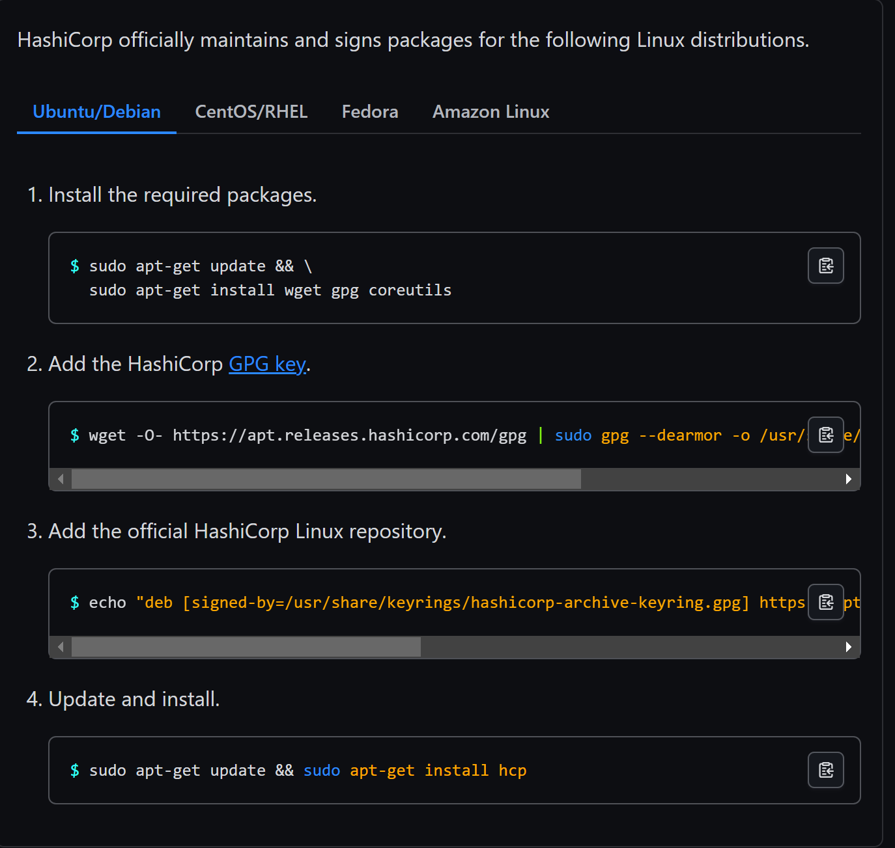
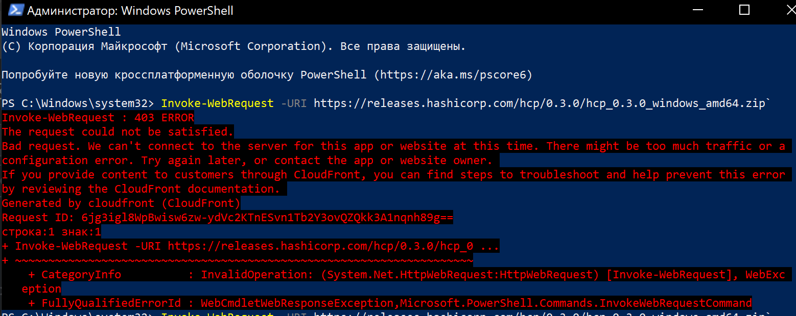
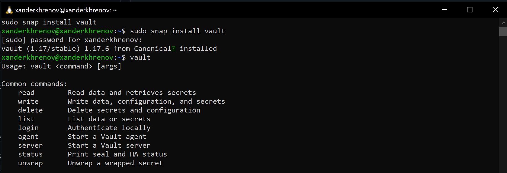
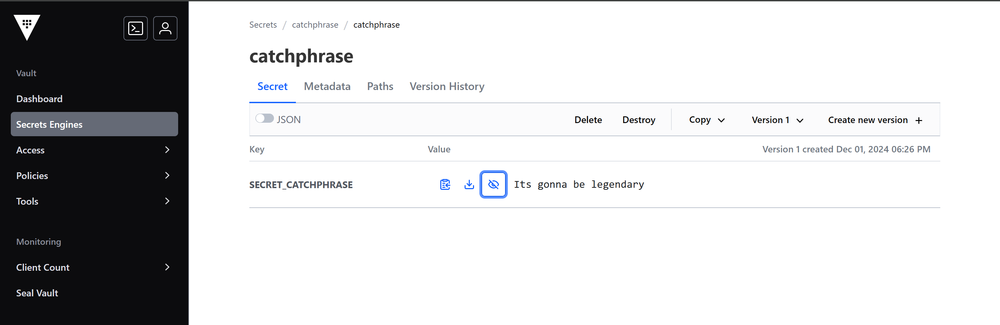
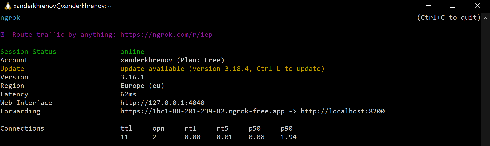
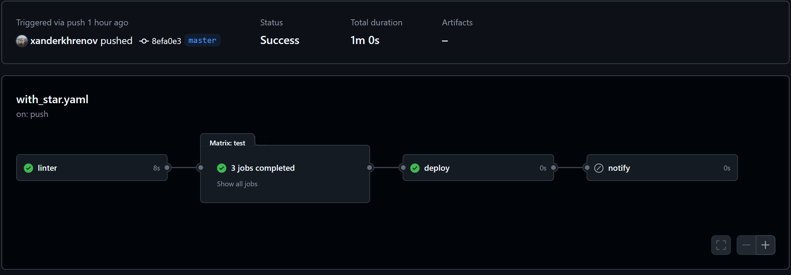

# Лабораторная работа №4 (Со звездочкой)

## Задание

Сделать красиво работу с секретами. Например, поднять Hashicorp Vault и сделать так, чтобы CI/CD пайплайн (или любой 
другой ваш сервис) ходил туда, брал секрет, использовал его, не светя в логах. В Readme аргументировать, почему ваш 
способ красивый, а также описать, почему хранение секретов в CI/CD переменных репозитория не является хорошей практикой.

## Небольшое отступление


Сначала я думал, что данная картинка прекрасно будет сочетаться с используемым иструментом (Вольт и вольт созвучно же?).
Потом я глянул, как зовут этого песеля на английском и все (Bolt). В общем, надеюсь, он добавит немного положительных
эмоций перед прочтением работы)

## А теперь к делу

Первым делом предстаяло установить CLI Vault на компьютер. Сначала была попытка установки на WSL с помощью команд с сайта,
но результатов это не дало. Ответ был: "Ресурс не доступен в вашем регионе".



Затем была произведена попытка установки через PowerShell (ну а вдруг). Но понятно, что опять не получилось.



Печально, очень печально. Но благо утилиту можно установить еще через ``sudo snap install vault``, что мы и сделали.



## Создание секретиков


Запускаем vault через ``vault server -dev``. Переходим на адрес, указанный в консоли, вводим токен из нижних строчек.
Красота, нас пустили, теперь можно создавать секретики. Как и в предыдущей работе, в качестве секрета была указана фраза 
одного из персонажей известного сериала.



## Публичный адрес

Для того, чтобы Github смог подтянуть с запущенного нами Vault нужные секреты, нам нужно получить публичный адрес. Для этого
воспользуемся, например, ngrok.



Ура, адрес получен! Переходим к настройке CI/CD файла, для подтягивание секретика.

## CI/CD файл

За основу был взят "хороший" файлик из обычной лабораторной. Полная версия представлена [здесь](https://github.com/xanderkhrenov/cloud-systems-lab4/blob/master/.github/workflows/with_star.yaml),
но самое интересное представлено ниже.

```yaml
  test:
    needs: [ linter ]
    strategy:
      matrix:
        version: [ 3.7, 3.9, 3.12 ]
    runs-on: ubuntu-latest
    env:
      test_requirements: ./requirements/test.txt
      tests_path: ./test/test_hypotenuse.py
      VAULT_ADDR: ${{secrets.VAULT_ADDR}}
      VAULT_TOKEN: ${{secrets.VAULT_TOKEN}}
    steps:
      - name: Checkout
        uses: actions/checkout@v4
      - name: Set up vault
        run: sudo snap install vault
      - name: Set up Python
        uses: actions/setup-python@v5
        with:
          python-version: ${{matrix.version}}
      - name: Set up test library
        run: pip install -r $test_requirements
      - name: Get secret from vault
        run: |
          export CATCHPHRASE=$(vault kv get -field=SECRET_CATCHPHRASE catchphrase/catchphrase)
          echo "CATCHPHRASE=$CATCHPHRASE" >> $GITHUB_ENV
      - name: Run test
        run: SECRET_CATCHPHRASE="$CATCHPHRASE" pytest $tests_path
```

Здесь в переменных окружения были созданы переменные для адреса Vault и токена (оба секрета добавлены на Github). 
При получении секретика было интересно. Сначала я экспортировал в переменную ``CATCHPHRASE`` на одном шаге, а использовал
на другом. Какого было удивление, когда в следующем шаге она была пустая. Почитал, посмотрел: оказывается, переменные
окружения, обявленные на одном степе, только в нем и остаются. Хотим использовать в другом месте - записываем в GITHUB_ENV.

Осталось проверить, что у нас ничего не сломалось и все прогоняется успешно.



Ееей!!! Все прошло успешно.

## Подводим итоги

21:08 01.12.2024. Вроде работа сделана. А чем было плохо использовать секреты на Github и почему использование Vault лучше?
Сейчас объясню.

1. Когда мы храним секретики на Github, все вроде хорошо, но вот злоумышленник получил доступ к нашему аккаунту и теперь
секретики - не секретики.
2. А что если этот нехороший человек среди нас? В плане maintainer. Тоже передал кому-то секрет и все.
3. На Github нет гибкой настройки управления секретами (ну либо я такой внимательный).

Все ну или почти все эти проблемы решаются Vault. Поэтому настроенное нами взаимодействие является красивым))

Как и прежде по любым вопросам по работе писать сюда [@xanderkhrenov](https://t.me/xanderkhrenov)